# Self driving car nanodegree
## Project 1: Finding lane lines

### Description

This is the first project of the Udacity's nanodegree in autonomous vehicles. In this project concepts of computer vision are used in order to detect lines on the street through a camera. For that the library OpenCV is used, together with other Python standard libraries.

For the project a pipeline of functions was developed to be applied first in images and after that in videos. 

### Development process
#### Development step by step with test image

The pipeline was developed first within the Jupyter Notebook "SDCND_Project1.ipynb" with the image "solidWhiteCurve.jpg".  Every step of the pipeline was tested before going to the next one. The test image was looking before any processing like this:

The steps applied to the image where:
1)  Convert it to gray scale using the OpenCV function "cvtColor"
2)  Apply a gaussian noise kernel to the grayscale image using the OpenCV function "GaussianBlur"
3) Apply the Canny edge detection algorithm using the OpenCV function "Canny". Here it is worth to see what is received after applying the algorithm. 

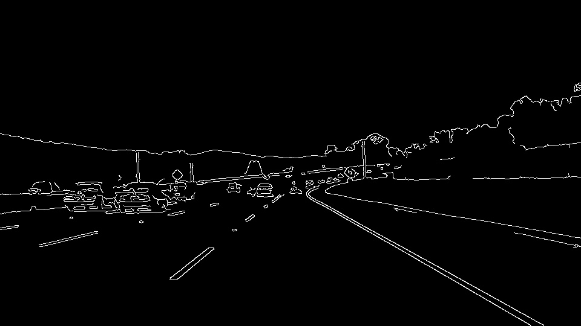

In the image can be seen that a lot of details are recognized as edges, specially the street lines are very clear. The execution of the algorithm was done with _low threshold_ equals to 50 and _high threshold_ equals to 150.

4) Select a part of the image to be used to detect the street lines.  That was done by creating a mask polygon located in the place where the lines are and drawing only the parts of the Canny image within the polygon, making black the rest. To define the polygon inside of the image the OpenCV function fillPoly is used, which fills the area defined by a polygon with vertices given as a numpy array. After that using the OpenCV function bitwise_and, the Canny image gets masked.

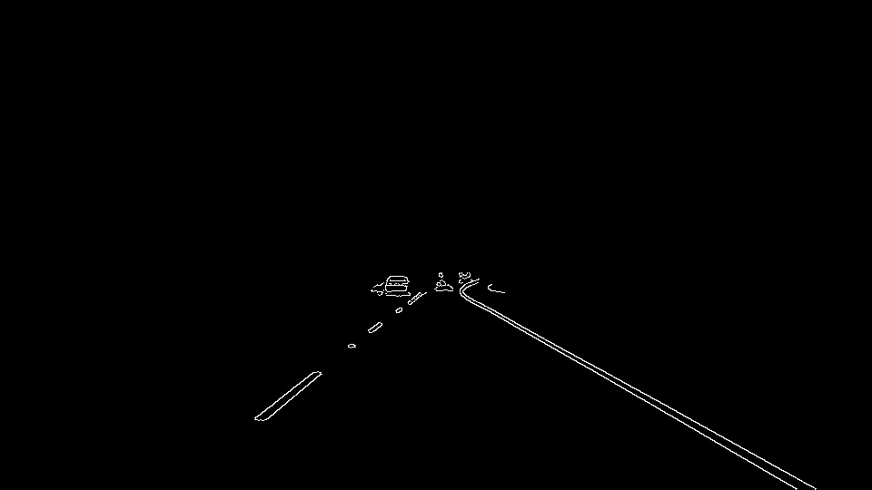

5) After that, the Hough transformation algorithm was applied on the masked image. To do that the OpenCV function "HoughLinesP" was used. This function return points describing lines, so it is needed to convert these points in lines. To do that the OpenCV function line is used for every group of points. 

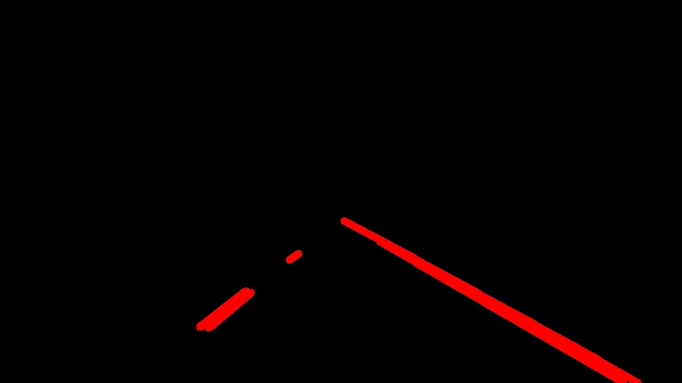

6) Finally, the lines image was overlaped with the original image getting the following image:

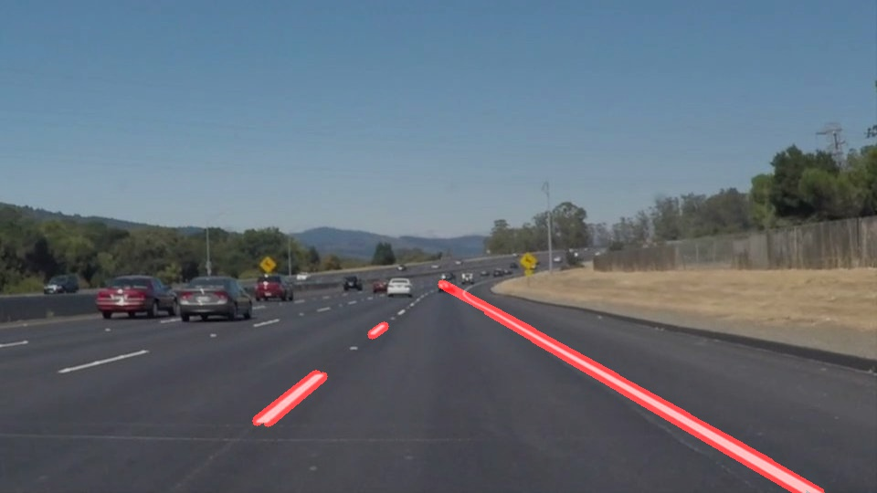

Here can be seen that the lines are accurate and drawn above the actual lines of the street.   The problem is that the dashed line is only shown in segments, but not as an entire line. To get a solid line, even when the line is dashed an extrapolation is needed.

In order to do that, the position at the beginning and at the end of the lines are calculated using the points resulting from the Hough transformation. The points resulting from the Hough transformation are separated in two groups, one for the right line and another one for the left line. To do that, two empty lists are created and with the slope value it is decided if they are part of the right line or of the left line. Then, these lists are iterated separately and for every point the x values corresponding to the bottom of the image and to the far horizon of the lanes are calculated and appended to two empty lists corresponding to the two X coordinate values. Then the average between all the calculated values corresponding to the two X coordinate values is calculated and with the two points a line is created into a blank image.

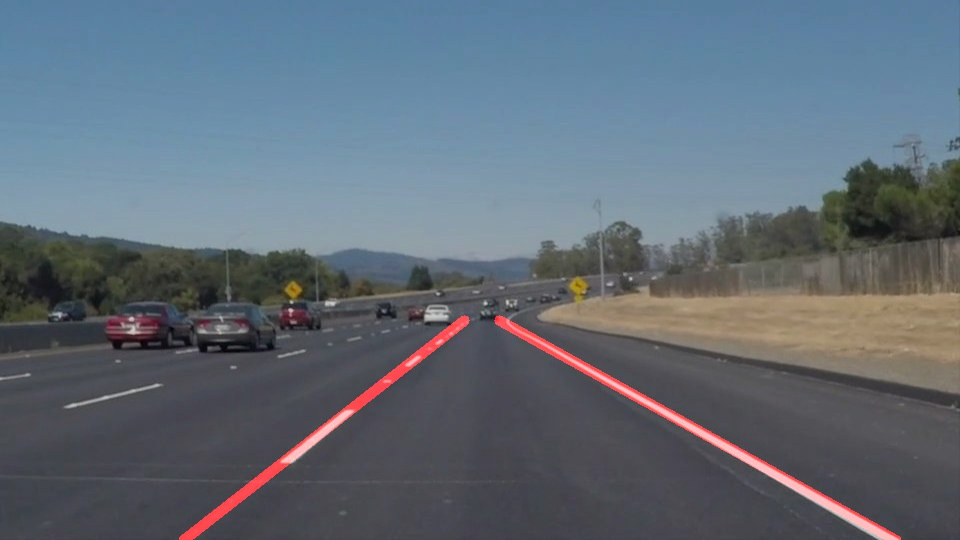

With this image it can be said that the pipeline works well, so it can be generalized for every image.

#### Development of dedicated functions for every step

After the pipeline was validated with the test image, the following functions were programmed:
- grayscale: Converts the image to grayscale (Step 1 of development with test image)
- gaussian_blur: Applies Gaussian Noise Kernel to the grayscale image  (Step 2 of development with test image).
- Canny: Applies Canny edge detection algorithm to the filtered image  (Step 3 of development with test image)
- region_of_interest: Masks the image returned by Canny within a polygon (Step 4 of development with test image).
- houghVertices: Creates a numpy array including the vertices for the mask polygon (Step 4 of development with test image).
- hough_lines: Detects the lines using Hough transformation on the Canny masked image and extrapolate the points to generate a line even if it is dashed. (Step 5 of development with test image).
- weighted_img: Overlaps the image with the lines with the original image (Step 6 of development with test image).

These functions were based on the initial functions provided by Udacity.

Every function was tested one by one with the image "solidWhiteRight.jpg"

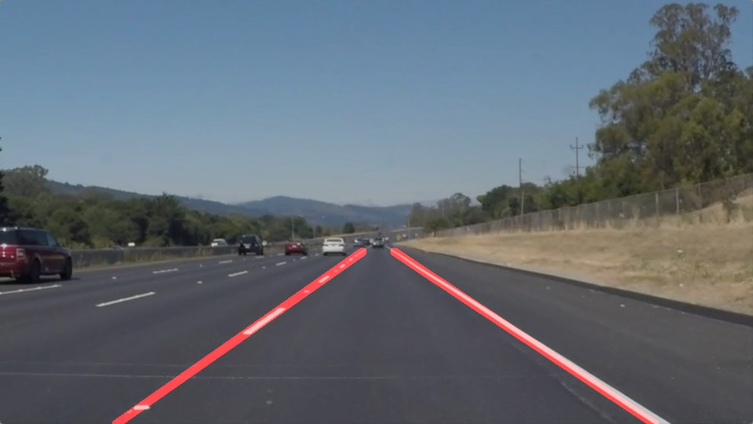

#### Development of one only function including the entire pipeline
To make the use of the pipeline easier, the function "findLines" was created, which includes every step of the pipeline in the right order. This function was tested with two images more "solidYellowCurve.jpg" and "solidYellowCurve2.jpg"

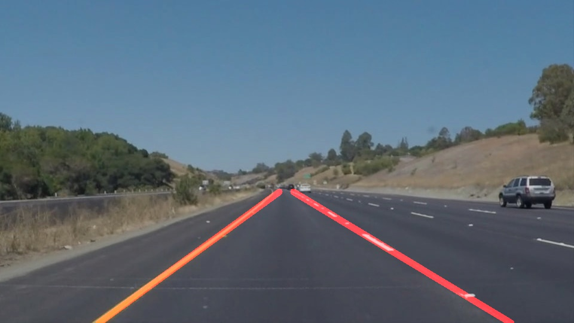

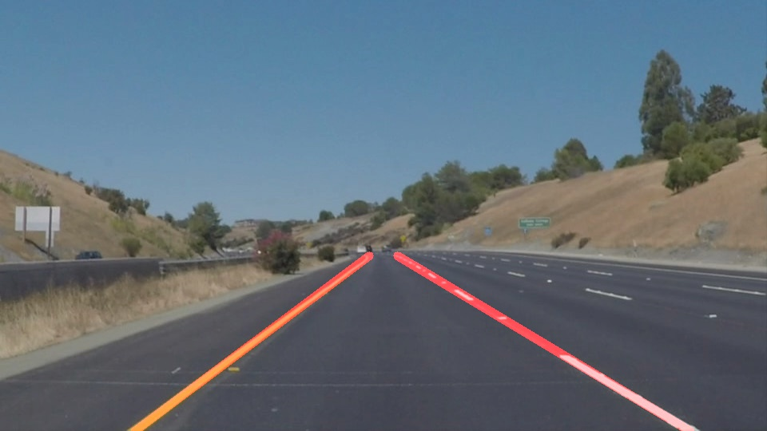

Here can it also be seen that the pipeline works well on the two other images, So now it is ready to be used on videos.

### Deployment of the pipeline on videos

To work on videos the standard librarie moviepy was used. To show the video on the jupyter notebook the standard library IPython was used. By using the code provided by Udacity to process the video. the pipeline was tested on the video "solidWhiteRight.mp4" getting good results.  The result of this test can be seen on ./test_videos_output/solidWhiteRight.mp4

It is important to remark that here the function "hough_lines" needed to be modified because it was crushing trying to get the average of an empty list of points. To do that, a verification was added and if a list of points is empty, the value of the last cycle (or in this case frame) is used.

After that, the pipeline was tested on the same way with the video "solidYellowLeft.mp4" getting also good results. This result can be seen on ./test_videos_output/solidYellowLeft.mp4

The first serious problems appeared by testing with the video "challenge.mp4". With this, it went evident that the Hough lines used to extrapolate the street lines needed to be filtered more strictly, so the function "hough_lines" needed to be changed again. 

Until now, those lines were being separated in two groups. The group of the right line of lines with slope greater than 0 and the group of the left line of lines with slope smaller than 0.  That was changed to only use the lines with slope between 0.5 and 1 to extrapolate the right line and the lines with slope between -1 and -0.5 to extrapolate the left line. Doing this change the result video improved from showing complete incoherent lines to show almost accurate lines. The result of this test can be seen on ./test_videos_output/challenge.mp4

One of the problems on the first processing of challenge.mp4 after changing the "find_lines" function is that the lines were too long. The other problem was, that the lines were moving a lot from their actual position on the video. 

To correct that, a frame of the video was taken and the pipeline was executed step by step in order to find where the process was going wrong.

By executing the pipeline on that frame two things were found out. First, the image has another resolution than the other pictures and videos, so the region of interest which is used to find the lines does not include enough information!. Additionally, the car can be seen in this frame and the edges are recognized in the Canny transformation, so these edges may be building lines as well, which get mixed with the street lines. The problem should be solved by making the region of interest wider and lifting it a bit, so the car does not get recognized by the Hough transformation.

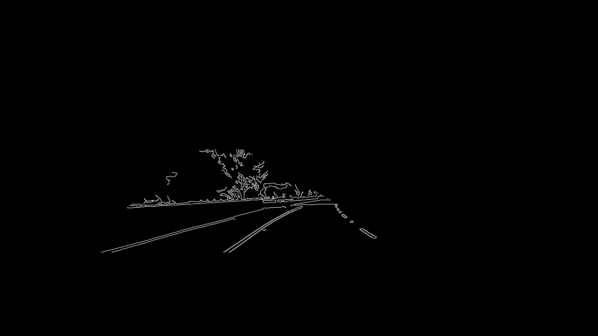

Now the function "houghVertices" was changed to take the parameter "lane_y_bottom" for the bottom of the region of interest instead of the bottom of the image, so the edges of the car can be ignored.

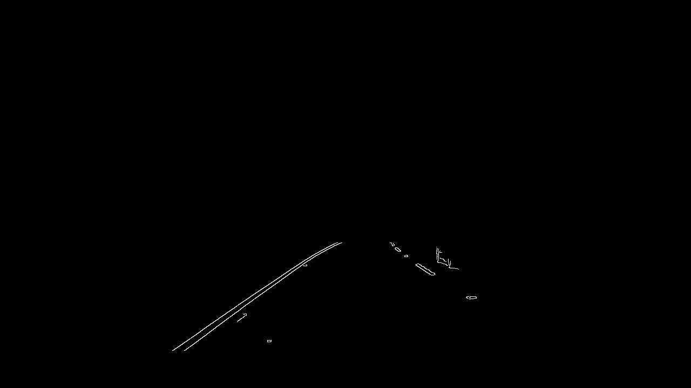

The next step was to get the Hough lines on this frame

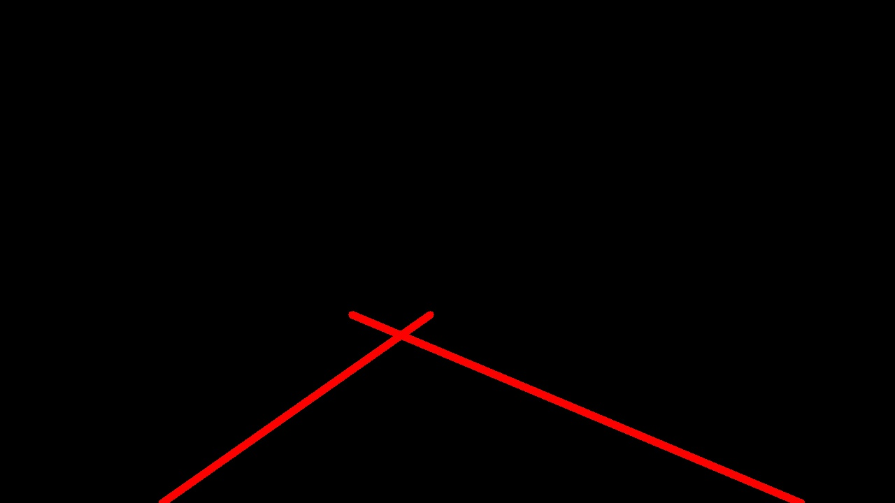

Here it could be seen that the lines where in logical positions but not exactly where they should be, specially the right line. So the Canny and Hough parameters might still need to be changed. But first, a new video with the changes was made. This can be seen on ./test_videos_output/Challenge_corrected_1.mp4

In that video where the lines looking surprisingly well, although the lines created with the pipeline of the last frame were wrong. The lines were not completely accurate though. So the Canny and Hough parameters were changed a little bit.

After changing the following parameters:
_Canny_low_threshold_ from 50 to 20. In order to make the pipeline detect more elements when the image gets lighter.
_Hough_theta_ from 2° to 1°. In order to make the line detection more accurate.
_Hough_min_line_len_ from 10 to 40. In order to make the line detection more accurate taking only longer lines.
_Hough_max_line_gap_ from 10 to 2. In order to make the pipeline detect lines with smaller gap between pixels.

A new video was generated, where the lines are very stable and accurate, they do not jump to other positions like in the first try on the challenge video and they barely move out from the position of the actual lines.   This video can be seen on ./test_videos_output/Challenge_corrected_2.mp4.

### Possible  problems and future work

After all the test is the pipeline working very well on diverse situations. But it can fail if the street lines get out from the slope ranges defined inside the function "find_lines". This can happen for example in the case of a very closed curve. To avoid that, the ranges can be made adaptative, changing their limit values on closed curves. 

Other problem might happen if the lines get out of the mask polygon, in this case they will not be recognized. An idea to avoid this problem would be to make the polygon bigger if no line is recognized. 

The last possible problem might happen if there is something else which resembles street lines inside the mask polygon. In this case they might be taken as street lines by the pipeline, making the measurement inaccurate. To avoid that, two smaller polygon can be used instead of only one big. 
 
